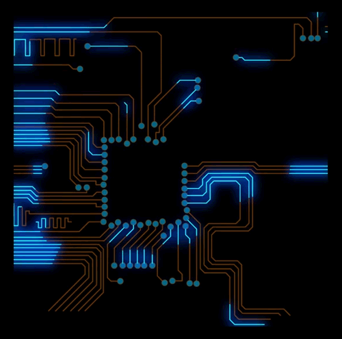

# BIO

⚡ Electronic Enginner | 💻 Software Developer | 🌌 Love for Space

My name is Edixon Piña, I am a computer electronics engineer and currently I am a
full-time software developer. I carry out projects and provide my services remotely to
companies around the world, working on the design, development and maintenance of software
both on the frontend and the backend.

<h2 align="center">Skills</h2>

  
  
  
  
  
  
  
  
  
  
  
  
  
  

<h2 align="center">Favorite Stack</h2>

  
  
  

